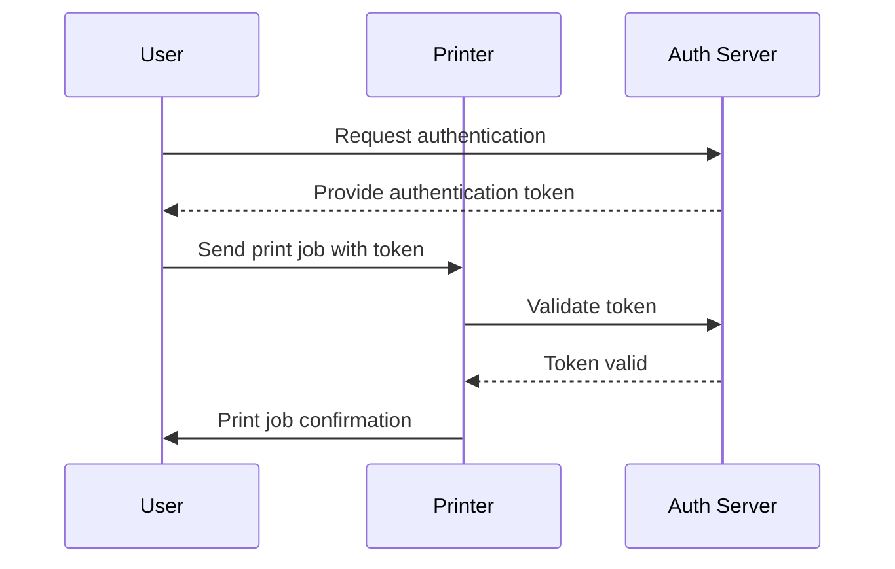

# Secure Print

## Security Model

```mermaid
sequenceDiagram
    participant User
    participant Printer
    participant Auth Server

    User->>Auth Server: Request authentication
    Auth Server-->>User: Provide authentication token
    User->>Printer: Send print job with token
    Printer->>Auth Server: Validate token
    Auth Server-->>Printer: Token valid
    Printer->>User: Print job confirmation
```

This README.md file describes the secure print process in detail.