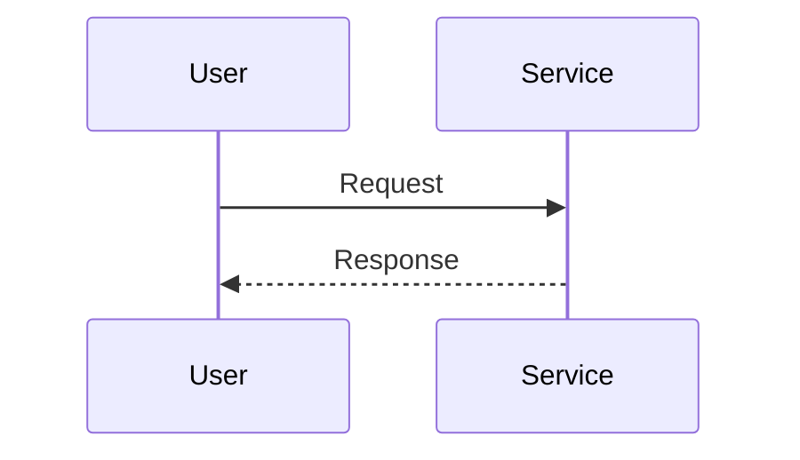

# Project Title

## Overview

This is a sample project demonstrating the use of sequence diagrams.

## Features
- Feature 1
- Feature 2

## Sequence Diagram



## Installation

1. Clone the repository.
2. Install dependencies.

## Usage

Run the project using the following command:

```
run your_project
```

## Contributing

Please submit a PR for any contributions you may want to make.

## License

This project is licensed under the MIT License.